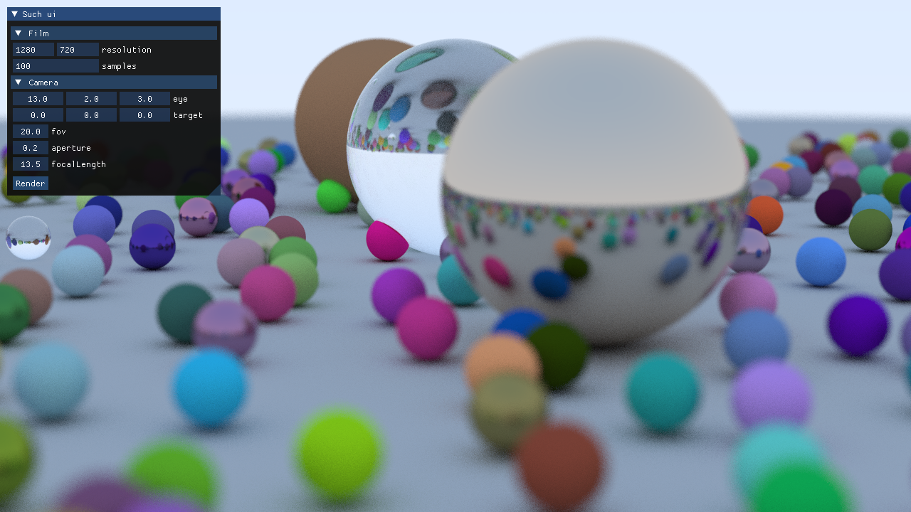

# graze

Implementation of Peter Shirley's series of [minibooks](https://t.co/RHZKjvseIT) in CUDA based on [nv-blog](https://devblogs.nvidia.com/accelerated-ray-tracing-cuda/).

## Dependencies
Building requires OpenGL dev libraries, CUDA and the dependencies of [glfw](https://github.com/glfw/glfw). [glfw](https://github.com/glfw/glfw), [dear imgui](https://github.com/ocornut/imgui) and a pre-generated version of [gl3w](https://github.com/sndels/libgl3w) are included as submodules.

## Building
Architecture and shading model matching the GPU should be set in CMakeLists.txt. Otherwise, the cmake + make build should work on Linux.
